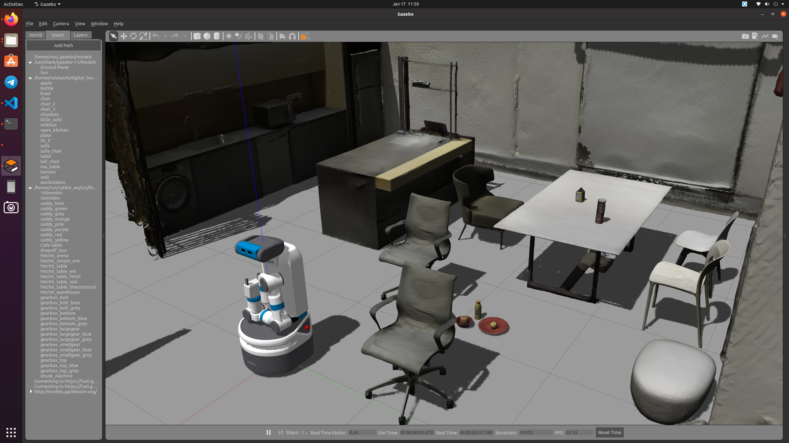

# Digital Twin

This is a digital twin of the Robot Living Studio. The project simulates the environment in GAZEBO and includes an integrated Fetch robot. The topics and control commands are identical to those of the real robot, ensuring that code developed in simulation will work seamlessly with the physical robot.

## System Requirements

### For Ubuntu Users

If you're running Ubuntu 20.04, we highly recommend using the original environment for speed and performance. While Docker is an option, the native setup ensures the best performance and stability.

#### Prerequisites for Ubuntu 20.04 Setup

- ROS Noetic installed
- Git installed on your system
- Python3 and required dependencies installed

### For Windows/macOS Users

If you're running Windows or macOS:

- **Windows**: Use either a Virtual Machine running Ubuntu 20.04 (recommended) or Windows Subsystem for Linux (WSL) with Ubuntu 20.04.
- **macOS**: Please note that macOS is not officially supported due to tedious display settings and lack of maintenance. Use Ubuntu 20.04 in a virtual machine if necessary.

Please follow the setup instructions in [INSTALL.md](INSTALL.md) for virtual machine and native ubuntu environment setup.

## Examples

The project includes several examples to help you get started with controlling the robot. These examples can be found in the `examples` folder and demonstrate various control commands and interactions with the robot.

To run an example:

1. Navigate to the examples folder.
2. Follow the instructions in [example's README](examples/README.md).
3. Try modifying the examples to understand how different commands affect the robot's behavior.

## Development

After setting up the environment, you can start developing:

- All necessary dependencies are provided in the Ubuntu environment setup.
- ROS commands and tools are available in the terminal.
- Use the provided examples as a reference for implementing your own robot control logic.
